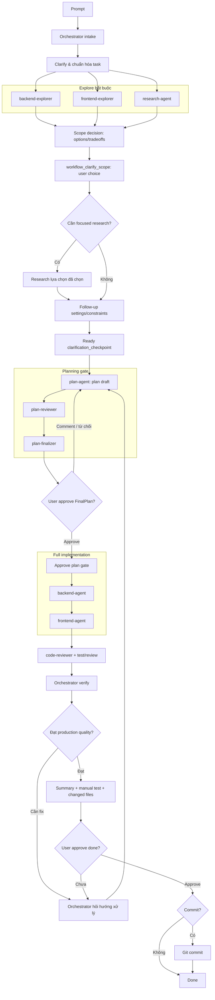
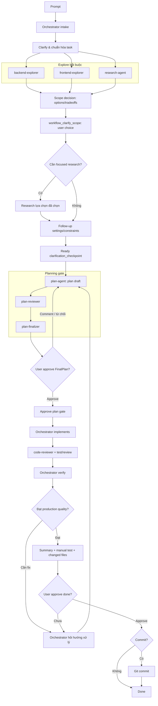

<p align="center">
  <a href="https://opencode.ai">
    <picture>
      <source srcset="packages/console/app/src/asset/logo-ornate-dark.svg" media="(prefers-color-scheme: dark)">
      <source srcset="packages/console/app/src/asset/logo-ornate-light.svg" media="(prefers-color-scheme: light)">
      
    </picture>
  </a>
</p>

<h1 align="center">opencode-workflow</h1>

<p align="center">
  Fork của OpenCode, tập trung vào CodeGraph-first codebase understanding, SOL workflow, orchestration có bằng chứng, skill evolution, 9router, và nguyên tắc <strong>bật là chạy</strong>.
</p>

<p align="center">
  <a href="https://opencode.ai/discord"></a>
  <a href="https://www.npmjs.com/package/opencode-ai"></a>
  <a href="https://github.com/anomalyco/opencode/actions/workflows/publish.yml"></a>
</p>

[](https://opencode.ai)

---

## Đây là gì?

`opencode-workflow` là một bản fork/evolution của [OpenCode](https://opencode.ai/docs/), một open-source AI coding agent cho terminal, desktop app và IDE extension. Fork này giữ nền tảng agent coding của OpenCode, nhưng thêm một lớp workflow để agent làm việc theo hướng:

- hiểu codebase bằng CodeGraph trước khi đọc file thủ công;
- chuẩn hóa yêu cầu bằng SOL workflow;
- bắt buộc explore/plan/review trước khi sửa;
- orchestration nhiều agent theo vai trò rõ ràng;
- ghi lại artifact/evidence để audit được quyết định;
- dùng skill theo task, không nhồi mọi skill vào context;
- học từ skill usage bằng SkillOpt-style proposal;
- hỗ trợ 9router model provider;
- giao tiếp với user bằng smart break để giữ đúng scope.

Nguyên tắc chính: **bật là chạy**. Điều này nghĩa là workflow, default tools, agent roles, approval gates và evidence trail được tích hợp sẵn để giảm setup/friction. Đây không phải lời hứa mọi máy, mọi provider, mọi repo đều zero-config.

---

## Vì sao fork này vượt trội hơn cách dùng agent coding mặc định?

Agent coding thông thường dễ rơi vào vòng lặp:

1. user prompt mơ hồ;
2. agent grep/read nhiều file để đoán context;
3. agent sửa sớm;
4. reviewer phát hiện thiếu file liên quan, UI lệch, logic hở, hoặc test không đủ;
5. phải quay lại hỏi lại user hoặc rewrite.

`opencode-workflow` thêm guardrail để giảm vòng lặp này:

| Năng lực | OpenCode gốc | opencode-workflow |
| --- | --- | --- |
| Codebase understanding | Agent có thể đọc/search file | CodeGraph-first cho symbol, callers/callees, trace, impact, affected tests |
| Planning | Có plan mode | SOL bắt buộc intake → explore → scope → clarification checkpoint → plan → review → final plan |
| Approval | Permission/tool approval | Approval gate cho plan, done, commit |
| Orchestration | Agent/subagent | Orchestrator + backend/frontend/research/plan/review/finalizer/code-reviewer agents |
| Skills | Load skill theo mô tả | Task-scoped skill loading, remote skill lease, SkillOpt-style review |
| User clarification | Agent có thể hỏi trực tiếp | Mandatory post-Explore `workflow_clarify_scope`; sub-agent vẫn dùng `BreakRequest` khi bị block |
| Evidence | Conversation history | Typed artifacts + evidence IDs cho từng bước quan trọng |
| Model routing | Provider/model support | Thêm 9router local OpenAI-compatible provider |

Các claim định lượng trong README này đều được gắn với nguồn bên ngoài hoặc ghi rõ là evidence liền kề, không phải benchmark local của repo này.

---

## Điểm khác biệt chính

### 1. CodeGraph-first codebase understanding

Workflow ưu tiên CodeGraph cho câu hỏi cấu trúc:

- symbol/context lookup;
- callers/callees;
- trace luồng gọi;
- impact analysis;
- affected-test planning.

`grep` vẫn đúng cho literal text như log message, string, comment, hoặc nội dung không cần quan hệ AST. Khác biệt là agent không phải bắt đầu bằng vòng lặp grep/read khi câu hỏi thật sự là “hàm này gọi ai?”, “đổi symbol này ảnh hưởng gì?”, hoặc “flow từ A tới B đi qua đâu?”.

Evidence liền kề: paper Codebase-Memory báo cáo indexed code graph retrieval dùng khoảng **~10x fewer tokens** và **2.1x fewer tool calls** so với file-exploration agent trên 31 repos, nhưng chất lượng tổng thể là **0.83 vs 0.92**. Đây là kết quả của Codebase-Memory, không phải benchmark local của `opencode-workflow`.

### 2. SOL workflow có approval gate

SOL trong fork này nghĩa là:

- **Spec**: chuẩn hóa yêu cầu, gọi rõ intent/scope/acceptance criteria.
- **Observe/Explore**: backend, frontend, research cùng explore trước khi plan.
- **Lead/Plan**: sau `clarification_checkpoint`, plan-agent tạo plan, plan-reviewer phản biện, plan-finalizer tạo FinalPlan.
- **Implement**: chỉ implement sau khi user approve FinalPlan.
- **Review/Verify**: code-reviewer + orchestrator kiểm test/review.

Workflow record typed artifact cho intake, explore, scope, clarification checkpoint, plan draft, plan review, final plan, implementation, code review, done approval và commit approval.

### 3. Orchestration theo vai trò

Thay vì một agent làm tất cả, workflow chia trách nhiệm:

- `orchestrator-agent`: chuẩn hóa task, hỏi user bằng `workflow_clarify_scope`, tổng hợp, kiểm gate.
- `backend-explorer`: hiểu backend/core/runtime.
- `frontend-explorer`: hiểu UI/docs/frontend surface.
- `research-agent`: web + GitHub research cho API, production reference code/structure, bug/error info, và cách xử lý đúng.
- `plan-agent`: tạo plan draft.
- `plan-reviewer`: review plan, bắt overclaim/risk/missing verification.
- `plan-finalizer`: tạo FinalPlan.
- `backend-agent`: implement backend trong Full workflow.
- `frontend-agent`: implement frontend trong Full workflow.
- `code-reviewer`: review/test chất lượng production.

### 4. Task-scoped skills, remote skill lease, SkillOpt-style evolution

Agent không nên load mọi skill mọi lúc. Fork này đi theo hướng:

- load skill đúng task/agent;
- remote skill có thể được lease cho task hiện tại;
- lease record source/raw URL/content hash;
- remote skill không được install/persist mặc định;
- skill usage có thể tạo SkillOpt-style proposal để cải thiện skill.

SkillOpt-agent/review là proposal-only/read-only. Nó không tự sửa, cài, promote, hoặc apply patch vào skill.

### 5. Frontend image/reference workflow primitives

Repo có hỗ trợ image attachment/preview và primitive OpenAI-compatible image generation provider. Điều này giúp frontend workflow dùng screenshot, design reference, hoặc asset generated bởi model phù hợp.

Không có claim “tăng productivity X%” ở đây. Image-capable workflow vẫn cần human review vì model có thể hiểu sai layout, spacing, accessibility, hoặc visual hierarchy.

### 6. 9router model support

Fork này thêm 9router như local OpenAI-compatible provider:

- endpoint ví dụ: `http://localhost:20128/v1`;
- env key: `NINE_ROUTER_API_KEY` khi setup yêu cầu;
- model ID như `cx/gpt-5.5` chỉ là ví dụ nếu 9router setup/account của bạn expose model đó;
- image generation được map cho một số model phù hợp theo metadata provider.

Caveat: local 9router service phải chạy. Không guarantee mọi model/account đều có sẵn. Khi fetch model fail, model list có thể rỗng hoặc dùng cache.

---

## Luồng SOL bằng hình ảnh

Mermaid render tốt trên GitHub-compatible Markdown. Nếu renderer của bạn không hỗ trợ Mermaid, hãy đọc prose ngay dưới mỗi sơ đồ.

### Full workflow: khi cần sửa từ 2 file trở lên

Runtime chọn Full sau FinalPlan approval khi `expectedChangedFiles.length >= 2`. Đây là heuristic theo số file dự kiến thay đổi, không phải classifier semantic cho “task khó”.



Sau Explore, checkpoint này là bắt buộc mọi lần. Orchestrator phải trình bày options/tradeoffs, lấy lựa chọn của user, có thể research sâu lựa chọn đó, hỏi tiếp settings/constraints, rồi chỉ cho `plan-agent` chạy khi `clarification_checkpoint` đã ready.

Research-agent trong Full workflow phải tìm thêm từ web/GitHub khi cần:

- API docs hiện hành;
- code production chuẩn để tham khảo cấu trúc;
- bug reports, known issues, edge cases;
- cách xử lý chính xác thay vì đoán.

Code-reviewer không chỉ đọc diff. Nó kiểm các vấn đề production:

- UI có đồng bộ với component/page cùng level không;
- UX có đủ smart không;
- workflow có điểm break không;
- logic có lỗ hổng không;
- thay đổi đã áp dụng đủ các file liên quan chưa;
- backend có chạy đúng scope không;
- thông tin có đủ để kết luận chưa;
- code có sạch không;
- có tạo dead code không.

Nếu review/test fail, workflow quay lại từ `plan-agent`, không nhảy thẳng vào sửa nhanh bỏ qua plan-review/finalizer.

### Lite workflow: case phổ biến là sửa 1 file

Runtime chọn Lite khi `expectedChangedFiles.length < 2`. Với Lite, governance vẫn giữ nguyên; khác biệt là orchestrator tự thực thi approved plan thay vì tách backend-agent → frontend-agent.



Lite không có nghĩa là “bỏ qua review”. Nó chỉ thay đổi executor của bước implementation.

---

## SkillOpt-agent governance

Khi orchestrator hoặc sub-agent dùng một hoặc nhiều skills, workflow có thể ghi SkillOpt-style proposal evidence. Nếu có proposal, done approval cần `skillopt_review` trước khi kết luận task.

Quy tắc governance:

1. SkillOpt-agent review proposal ở chế độ read-only/proposal-only.
2. Orchestrator phân biệt proposal generic với proposal thật sự custom cho task/user.
3. Orchestrator chỉ hỏi user nếu proposal vượt internal quality gate.
4. Mốc `>=20%` là target/gate nội bộ cho expected improvement, không phải kết quả được guarantee.
5. User có thể accept, comment, hoặc reject.
6. Nếu accept, việc sửa skill là follow-up riêng và vẫn cần approval trước khi edit.

Microsoft SkillOpt paper báo cáo kết quả benchmark-specific, ví dụ GPT-5.5 tăng **+19.1 đến +24.8 accuracy points** tùy harness. Đây là kết quả author-reported/preprint của SkillOpt, không phải guarantee cho repo này.

---

## Smart break: giao tiếp với user mà không mất scope

Sub-agent không hỏi user trực tiếp. Khi bị block, sub-agent emit `BreakRequest` gồm:

- task slice đang block;
- lý do block;
- câu hỏi cần hỏi user;
- options nếu có;
- evidence IDs;
- compacted context để resume.

Orchestrator nhận break, hỏi user một câu rõ ràng, gọi `workflow_resume_break`, rồi resume đúng sub-agent session bằng `ResumePackage`.

Cơ chế này giúp:

- không để sub-agent tự mở side conversation;
- giữ context gọn;
- buộc câu hỏi user bám vào task slice nhỏ nhất;
- giảm rủi ro implement sai scope.

---

## Cài đặt nhanh

Các lệnh cài đặt OpenCode upstream vẫn dùng được cho nền tảng gốc:

```bash
# YOLO
curl -fsSL https://opencode.ai/install | bash

# Package managers
npm i -g opencode-ai@latest         # hoặc bun/pnpm/yarn
scoop install opencode              # Windows
choco install opencode              # Windows
brew install anomalyco/tap/opencode # macOS/Linux, thường cập nhật nhanh
brew install opencode               # macOS/Linux, formula chính thức
sudo pacman -S opencode             # Arch Linux stable
paru -S opencode-bin                # Arch Linux AUR latest
mise use -g opencode                # Any OS
nix run nixpkgs#opencode            # hoặc github:anomalyco/opencode cho dev branch
```

> [!TIP]
> Xóa các bản cũ hơn `0.1.x` trước khi cài nếu gặp xung đột binary.

### Desktop App beta

OpenCode upstream có desktop application. Tải từ [releases page](https://github.com/anomalyco/opencode/releases) hoặc [opencode.ai/download](https://opencode.ai/download).

| Platform | Download |
| --- | --- |
| macOS Apple Silicon | `opencode-desktop-mac-arm64.dmg` |
| macOS Intel | `opencode-desktop-mac-x64.dmg` |
| Windows | `opencode-desktop-windows-x64.exe` |
| Linux | `.deb`, `.rpm`, hoặc `.AppImage` |

```bash
# macOS Homebrew
brew install --cask opencode-desktop

# Windows Scoop
scoop bucket add extras; scoop install extras/opencode-desktop
```

---

## Khi nào nên dùng opencode-workflow?

Nên dùng khi:

- repo lớn, nhiều module liên quan;
- task cần impact analysis;
- task cần plan có evidence;
- task có backend + frontend cùng thay đổi;
- UI/UX cần giữ consistency với page hiện tại;
- cần research API/GitHub/production reference trước khi implement;
- cần approval gate trước khi agent sửa code.

Có thể overkill khi:

- chỉ sửa typo nhỏ;
- không cần hiểu cấu trúc codebase;
- CodeGraph/index unavailable và task không đáng setup;
- user muốn chỉnh nhanh không cần plan/review trail.

---

## Repo evidence

Các capability chính có anchor trong repo:

- Workflow tools/artifacts/approvals: `packages/opencode/src/tool/workflow.ts`
- Workflow runtime/gates: `packages/opencode/src/workflow/runtime.ts`
- Workflow protocol/types: `packages/opencode/src/workflow/protocol.ts`
- CodeGraph/codebase tools: `packages/opencode/src/tool/codebase.ts`
- Tool registry: `packages/opencode/src/tool/registry.ts`
- Skill loading/lease/SkillOpt proposal: `packages/opencode/src/tool/skill.ts`
- Skill discovery/source metadata: `packages/opencode/src/skill/index.ts`
- Agent roles/config: `packages/opencode/src/agent/agent.ts`
- 9router provider: `packages/opencode/src/provider/provider.ts`
- Image generation primitive: `packages/core/src/github-copilot/responses/tool/image-generation.ts`
- Image attachments: `packages/app/src/components/prompt-input/image-attachments.tsx`
- Image preview: `packages/ui/src/components/image-preview.tsx`

---

## Dẫn chứng & giới hạn

- [OpenCode docs](https://opencode.ai/docs/) mô tả OpenCode là open-source AI coding agent cho terminal, desktop app và IDE extension.
- [OpenCode skills docs](https://opencode.ai/docs/skills/) mô tả `SKILL.md` và on-demand skill loading.
- [Microsoft SkillOpt](https://github.com/microsoft/SkillOpt) và [SkillOpt arXiv paper](https://arxiv.org/abs/2605.23904) là nguồn cho phần skill evolution. Số liệu trong paper là author-reported/preprint, không phải benchmark của repo này.
- [Codebase-Memory paper](https://arxiv.org/html/2603.27277v1) là evidence liền kề cho hướng indexed AST/code graph retrieval. Số liệu token/tool-call trong paper không phải benchmark local của `opencode-workflow`.
- [OpenAI image/vision docs](https://platform.openai.com/docs/guides/images-vision) và [Anthropic vision docs](https://docs.anthropic.com/en/docs/build-with-claude/vision) là nguồn cho capability/limit của image-capable models.
- [Anthropic context engineering](https://www.anthropic.com/engineering/effective-context-engineering-for-ai-agents) là nguồn cho giới hạn context, memory, compaction và token discipline.
- 9router support trong README này là compatibility với local OpenAI-compatible endpoint; không phải claim official partnership hoặc guarantee mọi model/account.

---

## Contributing, upstream, license

Fork này được xây trên OpenCode. Nếu đóng góp vào nền tảng upstream, đọc [contributing docs](./CONTRIBUTING.md) trước khi gửi pull request.

Nếu bạn dùng “opencode” trong tên project liên quan, hãy ghi rõ project đó có/không liên quan đến OpenCode team để tránh nhầm lẫn.

Giấy phép: xem [LICENSE](./LICENSE).

**Community upstream:** [Discord](https://discord.gg/opencode) | [X.com](https://x.com/opencode)
